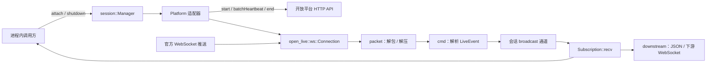

# 架构说明

本文面向维护者，说明当前实现的模块边界、会话生命周期与并发约束。配置和运行步骤见 [README](../README.md)，开发与验证方法见 [开发指南](development.md)，平台协议资料见 [开放平台文档](open-live/README.md)。

当前项目提供开放平台客户端、进程内会话管理及下游 WebSocket 服务。下文中的“订阅者”指持有
`Subscription` 的调用方，也包括每条下游连接；外部协议见 [客户端协议](downstream-protocol.md)。

## 模块边界

项目是一个 Cargo 包，库入口是 [src/lib.rs](../src/lib.rs)，可执行入口位于 [src/bin](../src/bin/)。

| 模块 | 职责 | 主要入口 |
| --- | --- | --- |
| `config` | 读取和校验进程环境变量，保存项目配置 | `Config::from_env` |
| `logging` | 为可执行程序安装全局 tracing subscriber | `logging::init` |
| `open_live::api` | 对 JSON 请求签名，调用开启、关闭、单场和批量心跳 API | `Client`、`StartResult` |
| `open_live::ws` | 官方连接鉴权、WebSocket 心跳、包解码和直播事件解析 | `Connection`、`LiveEvent` |
| `session` | 按身份码和房间复用会话，维护订阅、批量项目心跳及清理流程 | `Manager`、`Subscription` |
| `downstream` | WebSocket 接入、JSON 封装、独立发送及连接任务收尾 | `serve` |
| `bin` | 组装库功能，处理服务和示例程序的退出及日志 | `server`、`http_auth`、`ws_listen`、`multi_client` |

会话层通过私有的 [Platform / LiveSocket](../src/session/platform.rs) 调用平台能力。生产实现包装 `Client` 和 `Connection`，测试实现使用模拟平台。签名、二进制包和命令解析细节保留在各自模块内部。

## 标识与共享范围

| 标识 | 用途 |
| --- | --- |
| Access Key Id / Secret | 进程侧签名凭据，由配置传给 HTTP 客户端 |
| `app_id` | 一个 HTTP 客户端所属的开放平台项目 |
| 身份码 `code` | 开启互动的凭据，也是管理器接入索引 `by_code` 的键 |
| `room_id` | `start` 返回的房间号，作为 `by_room` 索引的键 |
| `game_id` | 一场互动的标识，用于项目心跳和结束调用 |

`Manager::clone()` 共享同一个内部 `State`。会话复用只发生在这个管理器及其克隆实例之间；分别构造的管理器、不同进程不会共享索引或心跳任务。

房间号不能替代身份码。管理器只有在 `start` 成功后才知道身份码对应的房间；如果平台拒绝另一身份码的开启请求，该次接入直接返回错误，不能保证转入已有房间会话。

## 会话接入与复用

接入逻辑位于 [manager.rs](../src/session/manager.rs)。

1. `attach` 去掉身份码首尾空白，拒绝空码；管理器开始关闭后拒绝新的接入。
2. 在 `by_code` 中占位。首个调用方负责开启，后续同码调用方等待同一会话的状态变化，避免并发重复调用 `start`。
3. 开启成功后，根据返回的房间号查询 `by_room`。如果已有可加入的会话，尝试关闭这次重复开启的场次，将身份码关联到已有会话，并重定向等待者。
4. 如果当前调用拥有该房间，立即注册已取得的 `game_id` 的项目心跳，再建立官方 WebSocket 并完成鉴权，创建事件广播通道，将会话发布为 `Ready`。
5. 创建首个订阅，启动上游接收任务。后续订阅共享解析后的事件，项目心跳保持原有调度周期。

当同码的上一场会话已经开始关闭但尚未清理完成时，新的接入会等待清理，再尝试开启。`attach` 遇到接入过程中的 `Closed` 且管理器仍可用时，会额外尝试一次；它不会在会话运行期间自动重连。

如果 `start` 失败，不调用 `end`。如果取得场次后建连失败，先移除项目心跳登记，再尝试 `end`，并通过 `SessionError::Connect` 保留建连失败和结束失败的说明。建连期间项目心跳失效或主动关闭管理器时，会取消建连并清理已开启的场次。

## 状态与并发约束

内部 `Phase` 使用 watch 通道向等待者发布状态：

| 状态 | 含义 |
| --- | --- |
| `Starting` | 正在开启场次或建立官方连接，同码接入等待结果 |
| `Ready` | 房间、场次、主播信息及事件通道已准备好 |
| `Attach` | 当前占位会话重定向到另一个已有会话 |
| `Failed` | 接入未完成，等待者收到对应的 `SessionError` |
| `Closed` | 已建立的会话完成清理，事件发送端被释放 |

“正在关闭”由订阅计数中的 `closing` 标记和停止信号表达，不是独立的 `Phase`。因此看到 `Ready` 仍需在订阅计数锁内确认可以加入，避免新订阅进入正在清理的会话。

实现维护以下约束：

- `tables` 锁保护身份码和房间索引的联动更新；网络请求和等待操作在释放锁后进行。
- `tables.sessions` 独立登记全部会话的生命周期。跨码复用时，即使索引已经重定向，原占位会话仍保留到重复场次的 `end` 完成，使 `shutdown` 能等待这次清理。
- 订阅计数、闲置截止时间与 `closing` 使用同一把锁。默认最后一个订阅释放后立即停止；配置宽限期时登记截止时间，重连取消截止时间。到期再次在锁内确认无人订阅并禁止加入。
- 删除索引和处理心跳结果时会比较会话指针，避免旧会话的清理影响已经替换的索引项。
- `Notify` 的等待先注册通知，再检查完成标记，避免检查与等待之间丢失唤醒。
- 会话到管理器、心跳登记到会话使用弱引用；活动上游任务持有管理器状态，直到清理结束。

首个接入任务还持有 `Leader` 清理守卫。如果接入 future 被取消，守卫发布失败；已经取得 `game_id` 时会另起任务尝试结束场次。这属于尽力清理：HTTP 响应尚未返回时无法知道远端是否已开启，守卫派生的清理任务也不属于正常会话关闭的等待流程。需要完整退出流程时，应协调接入任务结束并等待 `shutdown`，保持 Tokio runtime 存活。

## 两类心跳

| 心跳 | 负责人 | 驱动方式 |
| --- | --- | --- |
| 官方 WebSocket 心跳 | 每条 `Connection` | 持续轮询 `Connection::recv`，发送二进制心跳包 |
| 项目心跳 | 每个 `Manager` 的统一任务 | 定时收集活动 `game_id`，调用 `batch_heartbeat` |

配置默认间隔均为 20 秒。`Config` 校验 WebSocket 间隔为 1–29 秒、项目间隔为 1–59 秒；直接调用 `Manager::new` 或 `Connection::connect` 只校验间隔非零，调用方需自行选择合适的周期。

统一项目心跳任务在首个场次成功开启并取得房间所有权后启动，包括 WebSocket 建连及多地址鉴权期间。它跳过调度器第一次立即就绪的 tick，此后按同一周期运行，建连完成不会重新登记或重置失败计数。后来加入的会话从下一轮开始参与心跳。每轮按客户端上限 200 个 ID 分批、顺序发送；`Client::batch_heartbeat` 会拒绝空列表、空 ID、重复 ID 和超限列表。

心跳结果按场次处理：

- 请求成功：`failed_game_ids` 中的场次开始关闭，其余场次清零连续失败计数。
- 返回平台业务错误：本批全部场次开始关闭。
- 返回非业务错误，包括传输、HTTP 状态或解码错误：按场次累积连续失败，达到 3 次后开始关闭。管理器等待下一轮心跳，没有额外的即时重试。

使用低层 `Client` 和 `Connection` 时，调用方自己负责项目心跳。`Connection` 不会启动独立的心跳任务；长时间停止读取或在事件处理中阻塞，会影响 WebSocket 心跳和 Ping/Pong。

## 事件解析与订阅

[packet.rs](../src/open_live/ws/packet.rs) 按 16 字节大端包头拆包，支持原文和 zlib 压缩包，以及同帧多包、嵌套压缩。单包长度、解压输出、包数量和嵌套深度都有上限；新增协议支持时需要保留这些限制。

[cmd.rs](../src/open_live/ws/cmd.rs) 根据 `cmd` 构造 `LiveEvent`。已知命令的缺失字段使用声明的默认值，字段类型不匹配会返回解析错误；未知字段不保留在已知事件结构中。未知命令保留 `cmd` 与原始 `data`，缺失的 `data` 为 JSON `null`。

只有 `InteractionEnd` 的 `ends_push()` 为真。普通 `LiveEnd` 是下播事件，仍会转发，不会单独触发会话关闭。

每个会话通过 broadcast 通道分发 `Arc<LiveEvent>`，避免为每个订阅者重复解析和复制事件正文。生产构造的广播容量为 256 条，当前不通过配置暴露。

- 新订阅只接收订阅之后广播的事件，不回放加入前的消息。
- 慢订阅者被覆盖的未读事件不会补发。`recv` 返回 `Lagged { skipped }`，再次读取从仍保留的事件继续。
- 订阅读取不会阻塞上游或其他订阅者。上游发送 `InteractionEnd` 后开始清理；订阅者可继续读完保留的事件，然后收到 `Closed`。
- 事件没有持久化或重放。`downstream::protocol` 为 `LiveEvent` 提供独立序列化适配器，定义 `type / room_id / cmd / data` 消息；不改变官方事件枚举本身。

## 下游服务与闲置宽限期

`server` 绑定 `Config::listen()`，所有连接共享一个 `Manager`，并设置 `ManagerOptions::idle_grace`
为 30 秒。旧的 `Manager::new` 和 `Manager::from_config` 默认宽限期为零，保持立即清理行为。
每条 `/ws` 连接提交一次身份码，取得独立 `Subscription`；先发送 `ready`，再按序读取和发送事件。

每条连接的读写 future 并发运行，写端是唯一业务消息发送者，直接消费现有广播缓冲，不增加事件队列。
读端持续驱动控制帧，将首包和连接状态交给写端；缓冲覆盖映射成 `lagged`，发送失败或超时释放订阅。
Ping 发送开始前登记期望负载，读端只发布匹配当前 Ping 的确认；主动或旧 Pong 不会覆盖有效确认，也不会解除下一轮的超时。
接入期间断开仍推进 `attach` 至完成并释放结果。服务退出时同时推进 `Manager::shutdown` 和连接任务收尾，
不会直接 abort 接入任务。握手失败日志不记录客户端提交的头或 URL。

闲置截止时间通过 watch 通知上游任务，由其 select 循环驱动到期检查。宽限期间继续读取官方连接，
没有广播接收者时丢弃事件并保持两类心跳；新的订阅只接收加入后的事件。互动结束、上游故障、心跳失效
及主动 shutdown 都立即开始清理，不等待宽限期。

## 关闭与失败处理

最后一个订阅释放且闲置宽限期到期、上游正常关闭或读取失败、收到 `InteractionEnd`、项目心跳达到关闭条件，以及调用 `Manager::shutdown`，都会触发会话关闭。

已建立会话的上游任务负责统一清理：

1. 标记会话正在关闭，取消接收并从心跳登记中移除。
2. 尝试发送 WebSocket 关闭帧，最多等待 5 秒；失败或超时仅记录日志。释放连接后继续调用 `end`，不让上游写端背压阻塞后续清理。
3. 移除房间和身份码索引，发布 `Closed`，释放事件发送端。
4. 标记清理完成并通知等待者。

`Subscription` 的析构只更新计数、发出停止信号，不等待网络清理。`Manager` 的析构也不代替 `shutdown`：退出前应显式等待 `shutdown().await`，它先禁止新接入、停止批量心跳，再关闭并等待所管理的会话，包括接入中的会话和正在清理的重复场次。重复调用不会重复关闭已经完成的会话。

`shutdown` 不返回清理错误。结束失败记入日志后，本地仍完成移除；返回表示本地清理流程结束，不保证平台确认结束成功，也没有结束失败的自动重试。上游断开后不会重建连接，调用方需要重新 `attach`。

## 配置与日志边界

`Config::from_env` 只读取进程环境变量，不自动读取 `.env`。`RUST_LOG` 由日志初始化单独读取，`AUTH_CODE` 由示例程序读取；`server` 使用监听地址提供 `/ws`。

库只产生 tracing 事件，不自动安装全局 subscriber。可执行入口调用 `logging::init`；嵌入其他程序时也可以使用调用方已有的日志配置。后台会话任务和心跳任务显式携带 span 和当前 subscriber，以保留异步上下文。

日志以请求路径、项目、房间、场次、命令名和失败原因定位问题。签名凭据、身份码、鉴权正文与请求体不作为日志字段；示例程序在 debug 级别记录事件详情，可能包含弹幕等用户内容。过滤方式见 [README 的日志说明](../README.md#日志)。

## 设计取舍与当前边界

| 选择 | 理由与影响 |
| --- | --- |
| 按身份码占位，再按房间合并 | 同码并发只开启一次；跨码关联需要先取得平台返回的房间号 |
| 使用 broadcast 与共享事件 | 慢订阅者不会拖住其他订阅者，代价是缓冲溢出后丢失事件 |
| 每个管理器统一项目心跳 | 减少按房间发送的请求；大量会话需要分批顺序处理 |
| 用私有平台 trait 隔离网络 | 会话测试可以控制启动、连接、心跳和清理时序，无需真实凭据 |
| 将关闭集中在上游任务 | 订阅析构无需执行异步请求，完整退出需要显式等待管理器关闭 |

下游提供实时分发及 30 秒内重连复用，不补发历史事件。上游自动重连、持久化、多实例协调和公网部署尚未实现。
修改这些边界时，应同步更新本文、客户端协议、公共接口注释和行为测试。
