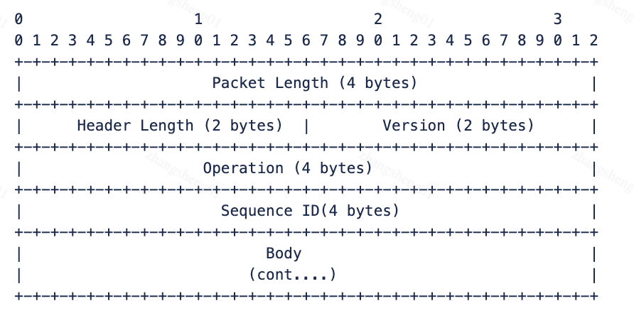
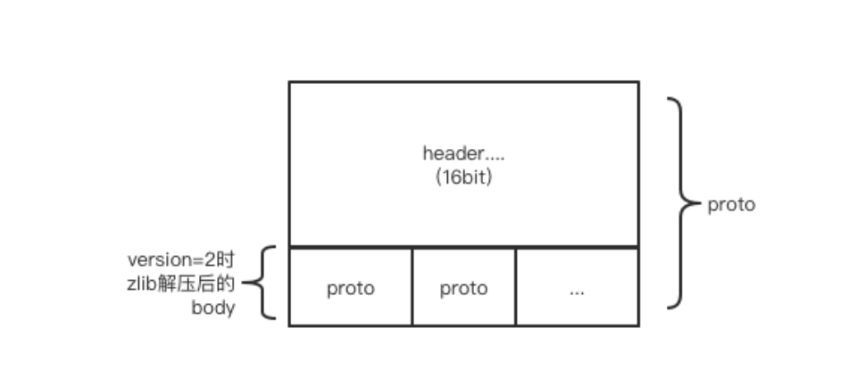

# 长链数据协议说明

> 整理自哔哩哔哩直播开放平台《开放平台-直播&互玩接入文档》。原文：[长链数据协议](https://open-live.bilibili.com/document/657d8e34-f926-a133-16c0-300c1afc6e6b)。
>
> 官方 WebSocket 上的二进制包格式、鉴权包与心跳包。

## 1. 发送AUTH包

通过应用API`/v2/app/start`接口获取到弹幕服务器地址并连接成功后，客户端首先发送一个Proto包，Operation字段置为OP_AUTH，Body字段为连接字符串，格式为json。JSON字符串为调用`/v2/app/start`接口中获取的auth_body字段。

## 2. 发送心跳

- 需要维持2个心跳，第一个为本WS连接中的心跳信息，第二个为本文档API说明中的心跳接口。前者用来维持WS连接本身持续有效，后者用于维持鉴权和互动能力数据持续推送。
- 心跳频率20s。
- ws的body为空即可。

协议格式：（基于websocket之上的应用层协议，所有字段 大端 对齐）。



- Packet Length：整个Packet的长度，包含Header。
- Header Length：Header的长度，固定为16。
- Version：
  - 如果Version=0，Body中就是实际发送的数据。
  - 如果Version=2，Body中是经过压缩后的数据，请使用zlib解压，然后按照Proto协议去解析。
- Operation：消息的类型：

| 名称 | 值 | 解释说明 |
| --- | --- | --- |
| OP_HEARTBEAT | 2 | 客户端发送的心跳包(30秒发送一次) |
| OP_HEARTBEAT_REPLY | 3 | 服务器收到心跳包的回复 |
| OP_SEND_SMS_REPLY | 5 | 服务器推送的弹幕消息包 |
| OP_AUTH | 7 | 客户端发送的鉴权包(客户端发送的第一个包) |
| OP_AUTH_REPLY | 8 | 服务器收到鉴权包后的回复 |

- Sequence ID：保留字段，可以忽略。
- Body：消息体，客户端解析Body之前请先解析Version字段。
- body的内容一般是json格式，里面一条广播消息称为cmd：

```json
// CMD参考
{
    "cmd":"LIVE_OPEN_PLATFORM_DM",
    "data":{
        "room_id":1,
        "uid":0,//用户UID(即将废弃)
        "open_id":"39b8fedb-60a5-4e29-ac75-b16955f7e632",//用户唯一标识(2024-03-11后上线)
        "uname":"",
        "msg":"",
        "fans_medal_level":0,
        "guard_level":0,
        "timestamp":0
    }
}
```

Version=2时，zlib压缩后的body格式可能包含多个完整的proto包（可以理解为递归）。



Demo：
**请参考关于快速开始中的案例说明demo**
